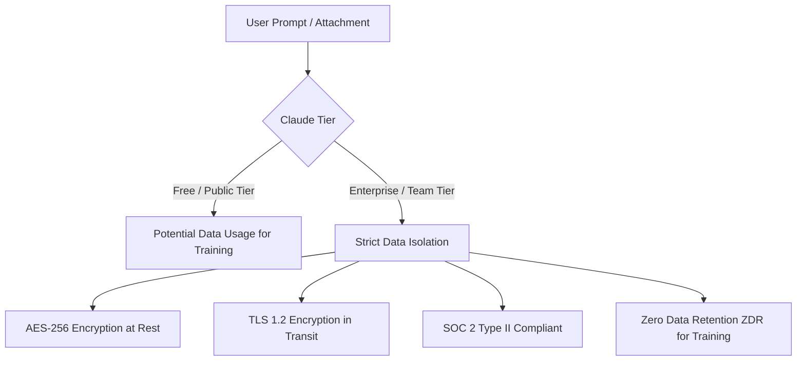

# Guide: Maximizing Team Efficiency with Claude Chat (GDPR Compliant)

**Prepared by:** Ümmügülsün Türkmen  
**Date:** June 29, 2026  
**Target Audience:** Apollo Green Solutions Team  
**Status:** Draft / Pending Review

---

## 1. Executive Summary: Transitioning to Claude
Apollo Green Solutions is consolidating its AI workflows under a single, secure enterprise tool. The goal is to migrate team operations from external, unregulated tools (such as public ChatGPT accounts) to **Claude Enterprise/Team Chat**. 

This transition ensures:
*   **Data Security:** Zero model training on company data.
*   **GDPR Compliance:** Robust security controls and data privacy standards.
*   **Team Alignment:** Shared prompt libraries, templates, and project knowledge bases.

---

## 2. GDPR Compliance & Data Privacy in Claude
A major risk of using public AI tools is that submitted data (documents, code, emails) may be used to train future public models, causing data leaks. Claude's Enterprise and Team tiers eliminate this risk.



### Key Security Commitments:
*   **Zero Model Training:** Anthropic does not use prompts, completions, or attachments from Team/Enterprise plans to train its generative models.
*   **Encryption Standards:** All data is encrypted in transit (TLS 1.2 or higher) and at rest (AES-256).
*   **Access Control:** Administrator controls enable workspace managers to invite, audit, and remove users as well as control API integrations.

### GDPR Best Practices for Apollo Team Members:
1.  **Stop Using Free Tiers for Company Data:** Never paste internal code, proprietary energy reports, or client emails into free/unregistered accounts of ChatGPT or Gemini.
2.  **Anonymize PII (Personally Identifiable Information):** When uploading documents that contain individual customer names, phone numbers, or private addresses, replace them with placeholders (e.g., `[Client A]`, `[City Y]`) before processing.
3.  **Utilize Folders and Projects for Clean Data Segregation:** Keep internal drafts separate from external client-facing assets by utilizing Claude's project structures.

---

## 3. Optimizing Team Efficiency via Claude Chat

Using Claude in a corporate environment is significantly different from individual usage. To maximize efficiency, the team should leverage the following features:

### A. Core Platform Definitions
*   **Projects (Persistent Knowledge):** Self-contained workspaces with their own chat history, custom instructions, and dedicated knowledge bases.
*   **Skills (Persistent Workflows):** Preset workflows under `Customize` that act as "expertise packages." They teach Claude how to execute repeatable processes automatically.
*   **Connectors (Unified Apps):** Integrations (Google Drive, Slack, Jira) that turn Claude into the command center for your entire workflow.

### B. Best Prompting Practice: The ICC Formula
To avoid generic responses, all team members should write prompts using the **ICC Formula**:
1.  **Instructions (I):** Define the exact task and actions Claude should take.
2.  **Context (C):** Set the stage with your role, background, objectives, and any relevant data (air on the side of more context).
3.  **Constraints (C):** Specify exact formatting, tone, length, rules, or provide an output example.

> [!TIP]
> **The Context Interview:** If you are unsure what context to include, add this sentence to the end of your prompt:  
> *"Please ask me any additional context questions you need to best complete this task."* Claude will interview you to tailor the output perfectly.

### C. Folder & Chat Organization
*   **Structured Naming:** Label chats with prefixes for easy scanning (e.g., `[Proposal] Client Name`, `[Code] Carbon Estimator API`).
*   **Topic Folders:** Group active chats into folders based on specific project domains (e.g., *Sustainability Reports, Sales Pitches, Frontend Dev*).

### D. Claude Projects over Global Settings (Crucial)
> [!IMPORTANT]
> **Common Mistake to Avoid:** Do not fill out the custom instructions at the account/profile level (under Settings). This applies those rules globally to all chats, leading to poor or weird responses.  
> **Better Practice:** Leave global settings blank and set custom instructions at the **Project level** so they are strictly scoped to the correct context.

### E. Model Selection Guidelines
*   **Sonnet (with Extended Thinking):** The default model for daily reasoning, writing, and analytical tasks.
*   **Opus:** The most powerful model, to be used for highly complex tasks or advanced coding.

### F. Reusable Document Templates
Instead of writing complex prompts repeatedly, the team can establish prompt templates within Projects. For example:

> **Template: Proposal Formatting Prompt**
> ```text
> Act as a Technical Editor for Apollo Green Solutions. 
> Below is a raw energy savings report. Read this template [Template_File.md] and reformat the raw data to match its tone, structure, and Markdown style.
> [Raw Data Here]
> ```

---

## 4. Key Differences: Claude vs. ChatGPT for Teams

| Capability | ChatGPT (Free/Plus Tiers) | Claude Team/Enterprise | Apollo Impact |
| :--- | :--- | :--- | :--- |
| **Data Privacy** | Opt-out required; high risk of training leaks. | **ZDR (Zero Data Retention) by default.** | Complies with European data protection regulations. |
| **Context Window** | Up to 128k tokens; performance degrades. | **200k+ tokens; highly accurate retrieval.** | Allows parsing of entire codebases or 100+ page energy audits. |
| **Artifacts View** | None (standard chat code block display). | **Interactive visual panels (code, UI mockups).** | Streamlines pair programming and website prototype reviews. |
| **Project Workspaces** | GPTs (often public/less collaborative). | **Projects (secure, shared team workspaces).** | Pools company knowledge in one organized, shared hub. |

---

## 5. Next Steps for the Team
1.  **Request Access:** Ensure you have received your official login from the administrator to join the Apollo Claude Workspace.
2.  **Move Active Workflows:** Bookmark Claude Chat and migrate daily coding/auditing tasks here.
3.  **Contribute to Project Files:** Upload your team-specific templates to the shared projects folder so the rest of the team can use them.
