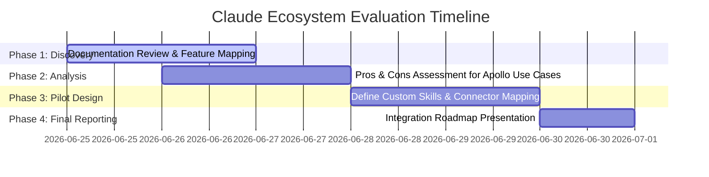

# Research Plan: Claude AI Model Integration & Capabilities

**Prepared by:** Ümmügülsün Türkmen  
**Date:** June 25, 2026  
**Target Organization:** Apollo Green Solutions  
**Status:** Completed (Submitted to Alexandra)

---

## 1. Executive Summary
This research plan outlines the methodology and objectives for evaluating the Claude AI ecosystem (including Claude 3.5 Sonnet/Opus models and team collaboration tools) within Apollo Green Solutions. The goal is to determine how Claude can optimize internal workflows, automate documentation, and enhance collaborative engineering and knowledge management.

---

## 2. Research Objectives
- **Understand Collaborative Ecosystems:** Analyze Claude's workspace, project sharing, and team collaboration features.
- **Evaluate Document Automation:** Test Claude’s efficiency in reading and generating business documents (Excel, PowerPoint, Word, PDFs).
- **Assess Technical Customization:** Explore how custom system instructions (Skills) and autonomous sub-agents can be leveraged for specific company tasks.
- **Security & Data Compliance:** Ensure all interactions comply with data privacy requirements (GDPR, confidentiality of proprietary company datasets).

---

## 3. Scope of Research
The research focuses on four primary pillars of the Claude ecosystem:
1. **Claude Cowork:** Automated background task execution and local file processing.
2. **Claude Skills:** Defining reusable, role-based agent configurations.
3. **Projects & Sub-agents:** Isolated team workspaces and concurrent agent workflows.
4. **Connectors:** Native integrations with existing corporate tools (Slack, Google Drive, Notion, Jira).

---

## 4. Methodology & Timeline

### Phase 1: Feature Discovery & Mapping (Day 1)
*   Review documentation on Claude's latest APIs, model sizes (Sonnet vs. Haiku vs. Opus), and features.
*   Identify overlapping tools currently used by Apollo.

### Phase 2: Feasibility & Comparative Analysis (Day 2)
*   Perform a SWOT analysis (Strengths, Weaknesses, Opportunities, Threats) of each feature.
*   Determine the value proposition of implementing collaborative workspaces vs. standard standalone chat interfaces.

### Phase 3: Pilot Workflows & Skill Definitions (Day 3–4)
*   Draft experimental configurations for custom company roles (e.g., ESG Report Reviewer, UI/UX Design Assistant).
*   Map API connector permissions required for Google Drive and Slack.

### Phase 4: Synthesis & Final Recommendation (Day 5)
*   Consolidate all findings into a structured report for team evaluation.
*   Provide a step-by-step roadmap for deployment.
