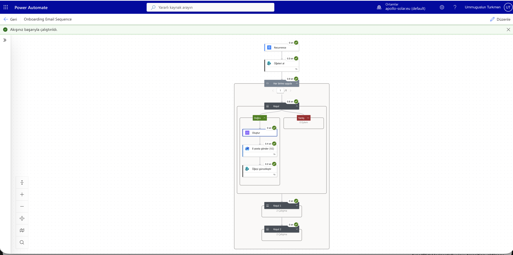
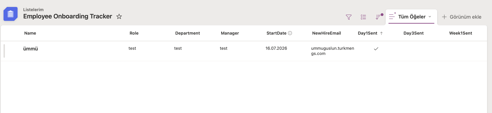

# Apollo Green Solutions — Employee Onboarding Automation

Automated employee onboarding email system for Apollo Green Solutions, built during an Erasmus+ internship in 2026.

When a new hire's details are entered, the system generates and delivers a personalized, branded welcome email — including a first-week schedule, onboarding checklist, and key contacts — with **zero manual effort from HR**.

📄 **[Full Technical Specification (Power Automate v2)](docs/power-automate-technical-spec.md)** — flow structure, OData filters, dynamic field formulas, known issues, and test results.

---

## 🏷️ Version History

### ✅ v2 — Power Automate (Current · Production)
> **Deployed:** July 2026 · **Status: Live**

Cloud-native, fully automated pipeline built on Microsoft 365. No installation required on any machine. HR adds a new hire row to Microsoft Lists — the rest is completely automatic.

**Stack:** Microsoft Power Automate · Microsoft Lists · Outlook (corporate account)

### 📦 v1 — Claude MCP + Python (Archived · Local)
> **Built:** July 2026 · **Status: Archived**

Local automation system with a custom Node.js MCP email server, Google Apps Script integration, and Python batch scheduler. Fully functional for personal/Gmail accounts. Archived due to corporate Outlook's Modern Auth (OAuth2-only) policy making SMTP App Passwords unavailable on the target tenant.

**Stack:** Claude Desktop · Node.js MCP Server · Python · Google Apps Script · SMTP

---

## 📸 Screenshots (v2 — Live System)

**Power Automate Flow — Successful Run**


**Microsoft Lists — Employee Onboarding Tracker**


**Delivered Email — Corporate Outlook**


---

## 🚀 v2 — Power Automate System (Current)

### How it works

```
HR opens Microsoft Lists
        │
        ▼
   Adds new hire row
   (Name, Role, Email, StartDate…)
        │
        ▼
Power Automate runs daily at 08:00
        │
        ├─▶ Day 1 email?  ──▶ Send Welcome Email ──▶ Mark Day1Sent ✓
        ├─▶ Day 3 email?  ──▶ Send Check-In Email ──▶ Mark Day3Sent ✓
        └─▶ Week 1 email? ──▶ Send Week 1 Recap   ──▶ Mark Week1Sent ✓
```

### Microsoft Lists Schema

| Column | Type | Notes |
|---|---|---|
| `Name` | Single line of text | Renamed from "Title" |
| `Role` | Single line of text | |
| `Department` | Single line of text | |
| `Manager` | Single line of text | |
| `StartDate` | Date only | No time component |
| `NewHireEmail` | Single line of text | Not "Person" type |
| `Day1Sent` | Yes/No | Default: No |
| `Day3Sent` | Yes/No | Default: No |
| `Week1Sent` | Yes/No | Default: No |

### Flow Architecture

1. **Recurrence trigger** — Runs daily 08:00, explicit time zone set (not UTC)
2. **Get items (SharePoint)** — OData filter: `Week1Sent eq 0` (fetches anyone with pending emails)
3. **Apply to each** — Loops over pending employees
4. **3 × Condition branches** — Day 1 / Day 3 / Week 1 with catch-up logic:
   - Uses `greaterOrEquals` + `addDays` instead of exact-day match
   - Ensures emails still send even if flow missed a day (weekend / outage)
5. **Compose action** — Raw HTML template with dynamic content injected (bypasses the rich-text editor that would mangle HTML)
6. **Send an email (V2)** — Sends via pre-consented corporate Outlook connector (no IT approval needed)
7. **Update item** — Flips boolean flag to prevent duplicate sends

### How HR uses it (Alexandra's workflow)

1. Open [Employee Onboarding Tracker](https://lists.microsoft.com) in any browser
2. Click **+ New** and fill in the new hire's details
3. Close the browser

**That's it.** The flow wakes up every morning at 08:00 and handles all email sending automatically.

---

## 📦 v1 — Claude MCP + Python System (Archived)

This was the original system, fully working for Gmail/personal SMTP accounts.

### Architecture

```
LEVEL 1 — CLAUDE CHAT (Primary)
┌──────────────┐     ┌──────────────────┐     ┌─────────────────┐
│ Claude Chat  │────▶│ MCP Email Server │────▶│ Employee Inbox  │
│ "Onboard…"   │     │ (Node.js + SMTP) │     │ 📧 Branded HTML │
└──────────────┘     └──────────────────┘     └─────────────────┘

LEVEL 2 — GOOGLE FORM (Quick)
┌──────────────┐     ┌──────────────────┐     ┌─────────────────┐
│ Google Form  │────▶│ Google Apps Script│────▶│ Employee Inbox  │
│ (fill & go)  │     │ (auto-trigger)   │     │ 📧 Branded HTML │
└──────────────┘     └──────────────────┘     └─────────────────┘

LEVEL 3 — CSV BATCH (Scheduled)
┌──────────────┐     ┌──────────────────┐     ┌─────────────────┐
│ CSV file     │────▶│ Python Scheduler │────▶│ Employee Inbox  │
│ (add row)    │     │ (Monday 09:00)   │     │ 📧 Branded HTML │
└──────────────┘     └──────────────────┘     └─────────────────┘
```

### Why it was archived

The corporate Microsoft 365 tenant enforces **Modern Authentication (OAuth2)** only. SMTP App Passwords are disabled organization-wide — this is a tenant-level security policy, not a configuration issue. Any application sending mail through a corporate `@apollo-gs.com` account via SMTP requires an Azure App Registration with IT admin consent.

Rather than route through IT, the system was rebuilt as v2 using Power Automate's pre-approved Outlook connector, eliminating the dependency entirely.

> **The v1 system still works perfectly for Gmail or any SMTP-compatible account.** All source files are preserved in this repository.

### v1 File Structure

```
onboarding-automation/
├── README.md
├── SKILL.md                              # Claude Desktop Skill definition
├── new_employees.csv                     # Input for batch processing
├── scripts/
│   ├── send_onboarding_email.py          # SMTP email sender
│   └── schedule_onboarding.py            # CSV monitor + auto-sender
├── templates/
│   ├── onboarding_email_template.html    # HTML email template
│   └── portal_template.html             # Interactive onboarding portal
├── google-apps-script/
│   └── Code.gs                          # Google Form trigger script
├── mcp-email-server/
│   └── server.mjs                       # Node.js MCP email server
├── Maria_Schmidt_Onboarding_Email.html  # Sample output: email
└── Maria_Schmidt_Onboarding_Portal.html # Sample output: portal
```

### v1 Quick Start (Gmail / personal SMTP)

```bash
# 1. Install MCP server dependencies
cd mcp-email-server && npm install

# 2. Set credentials
export SMTP_HOST=smtp.gmail.com
export SMTP_PORT=587
export SMTP_USER=your@gmail.com
export SMTP_PASSWORD=your-app-password

# 3. Run batch sender (once)
python3 scripts/schedule_onboarding.py --once

# 4. Or run Claude Desktop and type:
# "Onboard Maria Schmidt, Junior Energy Consultant, Engineering,
#  starting July 21, send to maria@example.com"
```

---

## 📧 Email Content (both versions)

Every welcome email includes:
- 🏢 Apollo company overview (mission, 3 pillars: Hardware, Software, Services)
- 📅 Personalized first-week schedule (Day 1–5 with real dates)
- ✅ Onboarding checklist (10 items)
- 👥 Key contacts (Manager, IT, HR, Office Manager)
- 🎨 Apollo branding (#004d40, official logo, responsive design)

## 🎨 Brand Specs

| Element | Value |
|---|---|
| Primary Dark Green | `#004d40` |
| Accent Green | `#1e7a4c` |
| Light Green BG | `#e6f5ec` |
| Body Background | `#f2f6f4` |
| Logo | Official Apollo logo (Wix CDN) |
| Font | Helvetica, Arial, sans-serif |

---

Built by Ümmu Gülsün · Apollo Green Solutions · Erasmus+ Internship 2026
