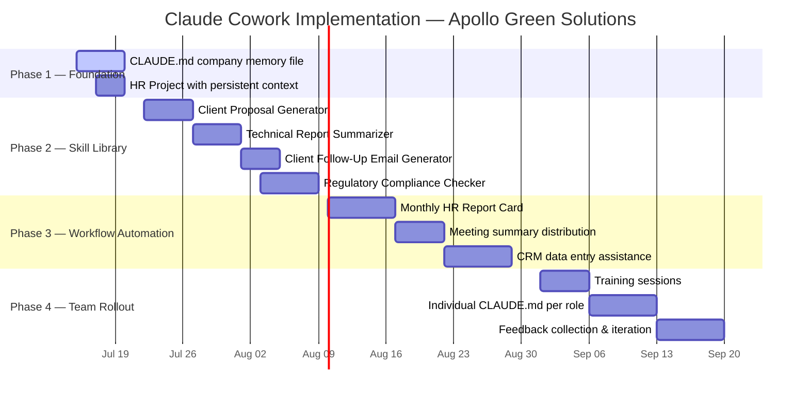
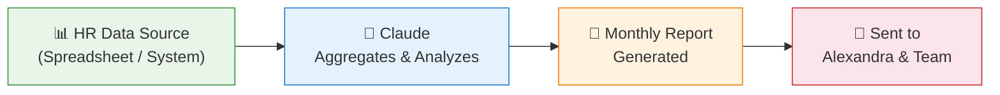
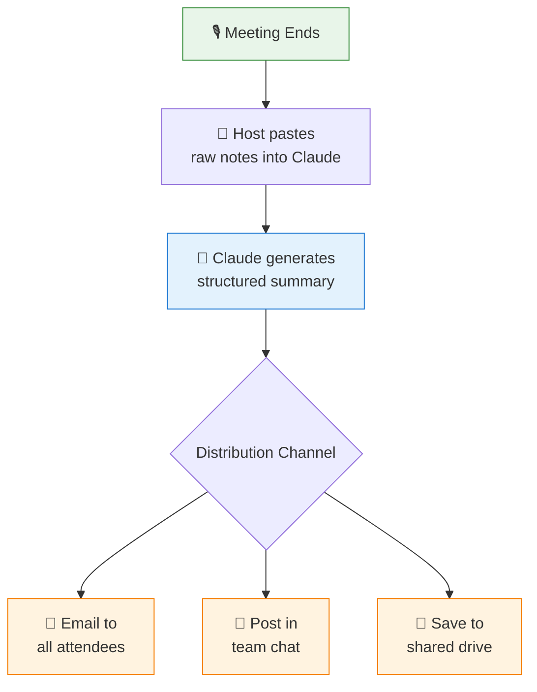
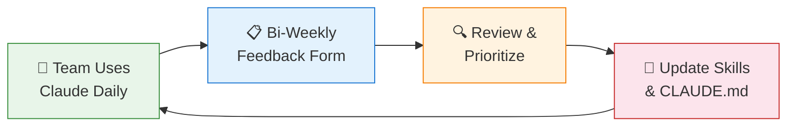

# 🗺️ Claude Cowork Implementation Roadmap

## Apollo Green Solutions — Advanced AI Workflow Strategy

> **Prepared by:** Ümmügülsün Türkmen (Erasmus Intern, HR & Digitalization)
> **Manager:** Alexandra Xanthopoulos
> **Date:** July 2026
> **Inspired by:** *"Set Up Claude Cowork better than 99% of people"* (YouTube, shared by Alexandra)

---

> [!NOTE]
> This roadmap transforms Apollo Green Solutions from basic AI usage into a **fully integrated Claude Cowork environment** — with persistent memory, reusable skills, and automated workflows tailored to our energy consulting business.

---

## 📊 Timeline Overview



---

## 🏗️ Phase 1: Foundation (This Week)

> **Goal:** Set up the persistent memory and project structure that everything else builds on.

---

### 1.1 📝 Create Company-Wide `CLAUDE.md` Memory File

| Detail | Description |
|---|---|
| **What it does** | A persistent memory file that Claude reads at the start of every conversation, ensuring it always knows who Apollo Green Solutions is, how we communicate, and what rules to follow. |
| **Why it matters** | Without this, every new Claude conversation starts from zero — you waste time re-explaining the company, tone, and rules. With `CLAUDE.md`, Claude behaves like a team member from the first message. |
| **Estimated effort** | 🟢 **Easy** (1–2 hours to draft, 30 min to refine) |
| **Prerequisites** | Access to the Claude Cowork / Projects feature; agreement from Alexandra on brand voice and data rules. |

#### What goes inside `CLAUDE.md`:

```markdown
# Apollo Green Solutions — Claude Persistent Memory

## 🏢 Company Identity
- **Name:** Apollo Green Solutions
- **Business:** B2B energy management consulting
- **Market:** Germany and EU (commercial & industrial clients)
- **Mission:** Helping businesses reduce energy costs and carbon footprints
  through data-driven consulting and smart technology integration.

## 🗣️ Brand Voice
- Professional but warm — we are consultants, not robots
- Sustainability-focused — always connect recommendations to environmental impact
- Clear and actionable — no fluff, every sentence should be useful
- Empathetic — we understand that energy transitions are complex for businesses

## 🚫 Never-Use Words
| ❌ Don't write | ✅ Write instead |
|---|---|
| utilize | use |
| leverage | use / build on |
| synergy | collaboration / combined benefit |
| circle back | follow up |
| deep dive | detailed review |
| low-hanging fruit | quick wins |
| move the needle | make a difference / create impact |
| disrupt | improve / transform |
| bleeding edge | cutting-edge / latest |

## 🔒 Data Privacy Rules (GDPR)
1. **NEVER** include real client names, addresses, or contract values in outputs
   unless explicitly authorized for that specific task.
2. **ALWAYS** anonymize data when creating examples or templates
   (e.g., "Client A" instead of real names).
3. **NEVER** share employee personal data (salaries, health info, addresses).
4. When in doubt, ask before including any potentially sensitive information.
5. All outputs must be compliant with EU GDPR and German BDSG regulations.

## 📄 Default Output Format
- Language: English (unless German is explicitly requested)
- Use headers, bullet points, and tables for readability
- Include a summary / TL;DR at the top of long documents
- Use metric units (kWh, MWh, €, km²)
- Date format: DD.MM.YYYY (German standard)

## 👥 Key Contacts & Roles
| Name | Role |
|---|---|
| Alexandra Xanthopoulos | Manager / Project Lead |
| Ümmügülsün Türkmen | Erasmus Intern — HR & Digitalization |
| [Add team members as needed] | — |
```

---

### 1.2 🗂️ Set Up Dedicated Claude Project for HR Operations

| Detail | Description |
|---|---|
| **What it does** | Creates a dedicated Claude Project (workspace) specifically for HR tasks — onboarding, document generation, policy drafts — with its own persistent context and uploaded reference files. |
| **Why it matters** | Keeps HR conversations separate from client work; the project remembers all HR context, templates, and previous outputs without mixing them with other business areas. |
| **Estimated effort** | 🟢 **Easy** (30 minutes to set up, plus uploading existing documents) |
| **Prerequisites** | Claude Pro/Team subscription with Projects feature; existing HR templates and onboarding documents ready to upload. |

#### 📋 Setup Steps:

> 1️⃣ Open Claude → Click **"Projects"** in the sidebar
>
> 2️⃣ Click **"New Project"** → Name it: `Apollo HR Operations`
>
> 3️⃣ Add the **Project Instructions** (paste the `CLAUDE.md` content above + HR-specific instructions)
>
> 4️⃣ Upload reference files:
>    - Employee handbook (if available)
>    - Onboarding checklist template
>    - The onboarding presentation we already built
>    - German labor law quick-reference
>
> 5️⃣ Start your first conversation inside the project to test it

---

## 🧰 Phase 2: Skill Library (Weeks 2–3)

> **Goal:** Build reusable Claude "skills" — prompt templates that any team member can trigger for common tasks.

> [!TIP]
> Think of each skill as a **recipe**: you provide the ingredients (inputs), and Claude always produces the same quality dish (output). This eliminates the "blank page problem" where people don't know how to prompt Claude effectively.

---

### 2.1 📄 Client Proposal Generator

| Detail | Description |
|---|---|
| **What it does** | Takes a client's name, industry, and energy consumption data as input and generates a structured consulting proposal in Apollo's branded format. |
| **Why it matters** | Proposals are our bread and butter — this skill cuts proposal drafting time from 3–4 hours to ~30 minutes, while maintaining consistent quality and branding. |
| **Estimated effort** | 🟡 **Medium** (3–5 hours: 1h to define template, 2–3h to write and test the prompt, 1h to iterate) |
| **Prerequisites** | 2–3 example past proposals (anonymized) to use as reference; agreement on standard proposal sections; `CLAUDE.md` file must be active. |

#### Skill Design:

```
📥 INPUTS:
   → Client name (or "Client A" for drafts)
   → Industry sector (e.g., manufacturing, logistics, retail)
   → Annual energy consumption (kWh or MWh)
   → Current energy costs (€/year)
   → Specific pain points (optional)

📤 OUTPUT:
   → Full proposal document with:
      • Executive Summary
      • Current Energy Profile Analysis
      • Recommended Solutions (with ROI estimates)
      • Implementation Timeline
      • Investment Overview
      • Next Steps
```

---

### 2.2 📊 Technical Report Summarizer

| Detail | Description |
|---|---|
| **What it does** | Takes a long technical PDF (energy audit, site assessment, regulatory report) and produces a concise executive summary with key metrics, findings, and recommended actions. |
| **Why it matters** | Our consultants receive 50–100 page technical reports regularly; this skill extracts what matters in 2 minutes instead of 45, freeing time for actual consulting work. |
| **Estimated effort** | 🟡 **Medium** (3–4 hours: prompt design + testing with 3–4 real reports) |
| **Prerequisites** | Claude's file upload capability; 3–4 sample technical reports for testing; defined summary template (what sections to always include). |

#### Skill Design:

```
📥 INPUTS:
   → Technical PDF (uploaded)
   → Summary length preference: short (1 page) / detailed (2–3 pages)
   → Audience: executive / technical / client-facing

📤 OUTPUT:
   → Executive Summary (TL;DR in 3 bullets)
   → Key Metrics Table (energy savings, costs, ROI, payback period)
   → Critical Findings (top 5, ranked by impact)
   → Recommended Actions (prioritized list)
   → Risk Factors / Caveats
```

---

### 2.3 ✉️ Client Follow-Up Email Generator

| Detail | Description |
|---|---|
| **What it does** | Takes meeting notes (bullet points are fine) and generates a professional follow-up email draft that summarizes discussion points, action items, and next steps. |
| **Why it matters** | Follow-up emails are critical for client trust but often delayed because consultants are busy; this skill ensures every client meeting gets a same-day follow-up in Apollo's professional tone. |
| **Estimated effort** | 🟢 **Easy** (1–2 hours: simple prompt with clear structure) |
| **Prerequisites** | `CLAUDE.md` brand voice rules; standard email signature template; 2–3 example follow-up emails for tone reference. |

#### Skill Design:

```
📥 INPUTS:
   → Meeting notes (bullet points / rough notes)
   → Client name and attendees
   → Meeting date
   → Urgency level: standard / high-priority

📤 OUTPUT:
   → Professional email with:
      • Warm greeting referencing the meeting
      • Summary of key discussion points
      • Clear action items (who does what, by when)
      • Next meeting / call proposal
      • Professional sign-off in Apollo tone
```

---

### 2.4 ✅ Regulatory Compliance Checker

| Detail | Description |
|---|---|
| **What it does** | Takes project details (client industry, size, energy usage, location) and identifies all applicable EU/German energy regulations, then generates a compliance checklist. |
| **Why it matters** | Regulatory compliance is non-negotiable in energy consulting — missing a regulation can mean fines for our clients and liability for us. This skill ensures nothing falls through the cracks. |
| **Estimated effort** | 🔴 **Hard** (6–10 hours: requires deep regulatory research, extensive testing, and regular updates as regulations change) |
| **Prerequisites** | Up-to-date knowledge of key regulations (NIS2, ISO 50001, EU Energy Efficiency Directive, German EnEfG, EnSimiMaV); legal team review of output accuracy; `CLAUDE.md` active. |

#### Skill Design:

```
📥 INPUTS:
   → Client industry and sub-sector
   → Company size (employees, revenue)
   → Annual energy consumption (MWh)
   → Location(s) in Germany / EU
   → Project type (audit, retrofit, new installation, monitoring)

📤 OUTPUT:
   → Applicable Regulations List (with brief description of each)
   → Compliance Checklist (actionable items per regulation)
   → Deadline Calendar (reporting deadlines, audit schedules)
   → Risk Assessment (penalties for non-compliance)
   → Recommended Certifications (ISO 50001, EMAS, etc.)
```

> [!WARNING]
> This skill produces **guidance only**, not legal advice. All compliance outputs must be reviewed by a qualified professional before being shared with clients. Include this disclaimer automatically in every output.

---

## ⚙️ Phase 3: Workflow Automation (Month 2)

> **Goal:** Move from manual skill triggers to **automated or semi-automated workflows** that run on a schedule or trigger.

---

### 3.1 📅 Monthly HR Report Card

| Detail | Description |
|---|---|
| **What it does** | On the 1st of every month, Claude aggregates team data (headcount, new hires, departures, training completed, open positions) and generates a one-page HR summary report. |
| **Why it matters** | Gives Alexandra and leadership a consistent, reliable monthly snapshot of team health without anyone having to manually compile data — especially valuable as the team grows. |
| **Estimated effort** | 🟡 **Medium** (4–6 hours: data source integration, template design, scheduling setup) |
| **Prerequisites** | Defined data sources (spreadsheet, HR system, or manual input template); report template approved by Alexandra; Phase 1 `CLAUDE.md` and HR Project set up. |

#### Workflow Design:



#### Report Sections:
- 📌 Team snapshot (headcount, FTEs, interns)
- 🆕 New hires this month
- 🚪 Departures this month
- 📚 Training & development completed
- 📋 Open positions and recruitment status
- 🎯 Key HR metrics vs. previous month

---

### 3.2 📝 Automated Meeting Summary Distribution

| Detail | Description |
|---|---|
| **What it does** | After every client call or internal meeting, the meeting host pastes raw notes into Claude, which generates a structured summary and distributes it to attendees. |
| **Why it matters** | Meeting notes are the #1 thing that gets lost or delayed in consulting firms; automated distribution ensures accountability, clear action items, and a searchable archive. |
| **Estimated effort** | 🟡 **Medium** (3–5 hours: prompt design, integration with email or Slack, template creation) |
| **Prerequisites** | Phase 2 Follow-Up Email skill (as a foundation); team agreement on meeting note format; distribution channel set up (email or team chat). |

#### Workflow Design:



---

### 3.3 🗄️ CRM Data Entry Assistance

| Detail | Description |
|---|---|
| **What it does** | Claude helps consultants quickly log client interactions, update deal stages, and maintain CRM records by accepting natural language inputs and formatting them for CRM entry. |
| **Why it matters** | CRM hygiene is chronically poor in consulting firms because data entry feels tedious; Claude removes the friction by accepting messy, natural-language updates and structuring them properly. |
| **Estimated effort** | 🔴 **Hard** (8–12 hours: CRM API integration research, data mapping, testing, security review) |
| **Prerequisites** | CRM system identified (e.g., HubSpot, Salesforce, Pipedrive); API access or integration method confirmed; GDPR-compliant data handling process documented; IT approval. |

#### Example Interaction:

```
👤 Consultant says:
   "Had a great call with Müller GmbH today. They're interested in a 
    full energy audit for their 3 factories. Budget around €50k. 
    Decision by end of August. Contact is Thomas Weber."

🤖 Claude formats for CRM:
   • Company: Müller GmbH
   • Contact: Thomas Weber
   • Deal Stage: Qualified Opportunity
   • Service: Full Energy Audit (3 sites)
   • Estimated Value: €50,000
   • Expected Close: 31.08.2026
   • Next Action: Send proposal by 22.07.2026
```

---

## 🎓 Phase 4: Team Rollout (Month 3)

> **Goal:** Get the entire Apollo team using Claude Cowork effectively — not just the intern who built it!

---

### 4.1 🎤 Training Sessions for All Team Members

| Detail | Description |
|---|---|
| **What it does** | Structured training workshops (2–3 sessions, 1 hour each) teaching every team member how to use Claude, the skill library, and the `CLAUDE.md` system — using the onboarding presentation we already built as a foundation. |
| **Why it matters** | Tools only create value when people actually use them; without training, 80% of the team will default back to old habits within a week. |
| **Estimated effort** | 🟡 **Medium** (4–6 hours: adapt existing presentation, create hands-on exercises, schedule sessions) |
| **Prerequisites** | Phases 1–3 completed and tested; onboarding presentation updated with Cowork content; meeting room / video call booked; Alexandra's buy-in for mandatory attendance. |

#### Training Agenda:

| Session | Topic | Duration | Format |
|---|---|---|---|
| 1️⃣ | What is Claude Cowork & why we use it | 45 min | Presentation + demo |
| 2️⃣ | Hands-on: Using the Skill Library | 60 min | Workshop (everyone tries it) |
| 3️⃣ | Advanced: Custom prompts & your personal `CLAUDE.md` | 45 min | Workshop + Q&A |

---

### 4.2 🧑‍💼 Individual `CLAUDE.md` Customization per Role

| Detail | Description |
|---|---|
| **What it does** | Each team member gets a personalized `CLAUDE.md` file that extends the company-wide one with their specific role context, common tasks, preferred output styles, and domain expertise areas. |
| **Why it matters** | A consultant doing energy audits needs completely different Claude behavior than someone in business development or operations — personalization makes Claude 10x more useful for each individual. |
| **Estimated effort** | 🟢 **Easy** per person (30–45 min per team member, working with them to define their needs) |
| **Prerequisites** | Company-wide `CLAUDE.md` finalized (Phase 1); training Session 3 completed; each team member's input on their common tasks and pain points. |

#### Example Role Customizations:

| Role | Custom Additions |
|---|---|
| **Energy Consultant** | Default units (kWh, MWh), common calculation formulas, audit report structure, client industries they cover |
| **Business Developer** | Proposal templates, pitch deck structure, competitor landscape, CRM field mappings |
| **Operations Manager** | Vendor list, procurement templates, budget tracking format, compliance calendar |
| **HR / Admin** | Employee data templates, onboarding checklists, leave policy references, German labor law quick-reference |

---

### 4.3 🔄 Feedback Collection and Iteration

| Detail | Description |
|---|---|
| **What it does** | A structured feedback process where team members report what works, what doesn't, and what new skills they need — feeding into continuous improvement of the Claude Cowork system. |
| **Why it matters** | The first version is never perfect; real-world usage will reveal gaps, edge cases, and new opportunities that we can only discover by listening to the team. |
| **Estimated effort** | 🟢 **Easy** (2–3 hours: create feedback form, schedule bi-weekly review, set up improvement tracking) |
| **Prerequisites** | All team members actively using Claude (Phase 4.1 completed); feedback form / channel created; designated person (intern or team lead) to review and act on feedback. |

#### Feedback Loop:



---

## 📊 Full Summary Table

| # | Item | Phase | Effort | Timeline |
|---|---|---|---|---|
| 1.1 | Company-wide `CLAUDE.md` | 🏗️ Foundation | 🟢 Easy | Week 1 |
| 1.2 | HR Project with persistent context | 🏗️ Foundation | 🟢 Easy | Week 1 |
| 2.1 | Client Proposal Generator | 🧰 Skill Library | 🟡 Medium | Week 2 |
| 2.2 | Technical Report Summarizer | 🧰 Skill Library | 🟡 Medium | Week 2–3 |
| 2.3 | Client Follow-Up Email Generator | 🧰 Skill Library | 🟢 Easy | Week 3 |
| 2.4 | Regulatory Compliance Checker | 🧰 Skill Library | 🔴 Hard | Week 3–4 |
| 3.1 | Monthly HR Report Card | ⚙️ Automation | 🟡 Medium | Month 2 |
| 3.2 | Meeting Summary Distribution | ⚙️ Automation | 🟡 Medium | Month 2 |
| 3.3 | CRM Data Entry Assistance | ⚙️ Automation | 🔴 Hard | Month 2 |
| 4.1 | Team Training Sessions | 🎓 Rollout | 🟡 Medium | Month 3 |
| 4.2 | Individual `CLAUDE.md` per Role | 🎓 Rollout | 🟢 Easy | Month 3 |
| 4.3 | Feedback Collection & Iteration | 🎓 Rollout | 🟢 Easy | Month 3+ |

---

## 🎯 Success Metrics

How we know this is working:

| Metric | Baseline (Now) | Target (Month 3) |
|---|---|---|
| Time to draft a client proposal | 3–4 hours | < 1 hour |
| Meeting follow-up email sent within | 24–48 hours | Same day |
| Monthly HR report creation time | Manual / not done | Automated |
| Team members actively using Claude | 1 (intern) | All team members |
| Client-facing documents with consistent branding | ~60% | 95%+ |

---

> [!IMPORTANT]
> **Next Step:** Start with Phase 1.1 — creating the `CLAUDE.md` file. This is the foundation that every other phase depends on. Ümmügülsün will draft it and Alexandra will review before it goes live.

---

*This roadmap is a living document. It will be updated as we learn what works and what needs adjustment.*
*Last updated: 15.07.2026*
