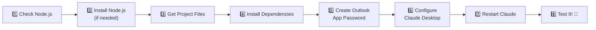

# 🚀 Apollo Onboarding Automation — Setup Guide

**For:** Alexandra Xanthopoulos (Manager)
**Prepared by:** Ümmügülsün Türkmen (Erasmus Intern)
**Date:** July 2026
**Company:** Apollo Green Solutions
**Platform:** Windows 10 / Windows 11

---

> [!NOTE]
> This guide will walk you through setting up the **Apollo Onboarding Automation** system on your **Windows PC**. It uses Claude Desktop's **MCP (Model Context Protocol)** feature to send branded welcome emails to new employees — automatically!
>
> **No coding experience needed.** Just follow each step carefully. ☕

---

## 📋 What You'll Need Before Starting

| # | Requirement | Status | Notes |
|---|------------|--------|-------|
| 1 | **Claude Desktop app** | ✅ Already installed | Should be on your PC already |
| 2 | **Node.js** (v18 or newer) | ❓ Check in Step 1 | Free download if missing |
| 3 | **Project files** | 📂 From GitHub or USB | Ümmügülsün can provide these |
| 4 | **Outlook App Password** _or_ company SMTP credentials | 🔑 Created in Step 5 | Requires your company Outlook account |

> [!IMPORTANT]
> **Estimated time:** 15–20 minutes for the full setup.
> You only need to do this **once**. After setup, everything works automatically inside Claude!

---

## 🗺️ Overview — What We're Doing

Here's the big picture of what this setup involves:



---

## Step 1️⃣ — Check if Node.js Is Installed

Node.js is a free program that runs our email server behind the scenes. Let's check if it's already on your PC.

### How to open PowerShell:

1. Click the **Start** button (🪟 Windows icon, bottom-left of your screen)
2. Type the word **PowerShell**
3. Click **"Windows PowerShell"** when it appears

A window with a blue (or dark) background will appear — this is PowerShell. It's like a text-based way to talk to your computer. Don't worry, it won't bite! 😊

> [!TIP]
> **Alternative shortcut:** Press **Win + X** on your keyboard, then click **"Windows PowerShell"** (or **"Terminal"** on Windows 11).

### Check for Node.js:

4. In the PowerShell window, **type** (or copy-paste) the following and press **Enter**:

```powershell
node --version
```

### What do you see?

| You see... | What it means | What to do |
|-----------|---------------|------------|
| `v20.15.0` (or any `v18.x.x` / `v20.x.x` / `v22.x.x`) | ✅ Node.js is installed! | **Skip to Step 3** 🎉 |
| `'node' is not recognized as an internal or external command` | ❌ Node.js is NOT installed | **Go to Step 2** ⬇️ |

---

## Step 2️⃣ — Install Node.js

> [!NOTE]
> Only do this step if Step 1 showed "'node' is not recognized". If you already have Node.js, skip to Step 3.

### Download Node.js:

1. Open **Edge** (or any web browser)
2. Go to: **[https://nodejs.org](https://nodejs.org)**
3. You'll see two big buttons. Click the one that says **"LTS"** (it's usually the green one on the left)
4. The website will automatically offer you the **Windows Installer (.msi)** — download it

> [!TIP]
> **LTS** stands for "Long Term Support" — it's the stable, recommended version. Always pick this one!

### Run the installer:

5. Once the file downloads, **double-click** the `.msi` file to open the installer
6. Click **Next** → **Accept the license** → **Next** → **Next** → **Install**
7. Click **Yes** if Windows asks "Do you want to allow this app to make changes?" (User Account Control)
8. Click **Finish** when it's done

> [!TIP]
> The Node.js Windows installer automatically adds Node.js to your system PATH — this means you can use the `node` and `npm` commands from anywhere. No extra steps needed! ✨

### Verify the installation:

9. **Close** the PowerShell window completely (click the ❌ at the top-right)
10. **Reopen** PowerShell (Start → type "PowerShell" → click it)
11. Type the following and press **Enter**:

```powershell
node --version
```

12. You should now see a version number like `v20.15.0` ✅

> [!WARNING]
> If you still see "'node' is not recognized" after installing, try **restarting your PC** and checking again. If it still doesn't work, contact Ümmügülsün for help.

---

## Step 3️⃣ — Get the Project Files

You need the `onboarding-automation` project folder on your PC. There are two ways to get it:

### Option A: From GitHub (recommended) 🌐

1. In PowerShell, type the following and press **Enter**:

```powershell
git clone https://github.com/ummugulsunn/erasmus-internship.git "$HOME\Documents\erasmus-internship"
```

2. This downloads the project into your **Documents** folder

> [!NOTE]
> If you see `'git' is not recognized`, you'll need to install Git first:
> 1. Go to **[https://git-scm.com/download/win](https://git-scm.com/download/win)**
> 2. Download and run the installer (accept all defaults)
> 3. **Close and reopen PowerShell**, then try the command again

### Option B: From USB Drive 💾

1. Plug in the USB drive Ümmügülsün gave you
2. Open **File Explorer** (press **Win + E**)
3. Copy the **`onboarding-automation`** folder from the USB drive
4. Paste it into your **Documents** folder (`C:\Users\Alexandra\Documents\`)

### 📍 Remember your project path!

After this step, your project files should be at one of these locations:

| Method | Your project path |
|--------|------------------|
| **Option A** (GitHub) | `C:\Users\Alexandra\Documents\erasmus-internship\onboarding-automation` |
| **Option B** (USB) | `C:\Users\Alexandra\Documents\onboarding-automation` |

> [!IMPORTANT]
> **Write down or copy your path!** You'll need it in Step 6.
>
> Not sure what your path is? In PowerShell, navigate to the folder and type:
> ```powershell
> pwd
> ```
> This shows your current location. You can also **drag the folder from File Explorer into the PowerShell window** — it will paste the full path automatically! 🪄

---

## Step 4️⃣ — Install Dependencies

The project needs some additional packages (like `nodemailer` for sending emails). Let's install them.

1. In PowerShell, **navigate to the MCP server folder**. Type the following (adjust the path to match where YOUR files are):

```powershell
cd "$HOME\Documents\erasmus-internship\onboarding-automation\mcp-email-server"
```

> [!TIP]
> **What is `cd`?** It stands for "change directory" — it's like double-clicking a folder in File Explorer, but in PowerShell.

2. Now type this and press **Enter**:

```powershell
npm install
```

3. Wait for it to finish. You'll see a progress bar and some text scrolling by. This is normal!

### What does success look like?

You should see something like:

```
added 18 packages in 3s
```

> [!WARNING]
> **If you see red ERROR messages**, try these fixes:
> - Make sure you're in the right folder (use `pwd` to check)
> - Make sure Node.js is installed (go back to Step 1)
> - Contact Ümmügülsün with a screenshot of the error

---

## Step 5️⃣ — Create an Outlook App Password

> [!IMPORTANT]
> **Why do we need this?** Outlook won't let apps use your regular password for security reasons. Instead, we create a special "App Password" that only our onboarding tool uses.
>
> **If you have separate company SMTP credentials**, skip this step and use those credentials in Step 6.

### Prerequisites for App Passwords:

- You must have **2-Factor Authentication (2FA)** enabled on your Microsoft account
- If you don't have 2FA enabled, go to [https://account.microsoft.com/security](https://account.microsoft.com/security) and enable "Two-step verification" first
- Or ask IT to confirm that 2FA is enabled on your company account

### Create the App Password:

1. Open your browser and go to: **[https://account.microsoft.com/security](https://account.microsoft.com/security)**

2. Sign in with your company Microsoft/Outlook account if prompted

3. Click **"Security info"** → **"Add sign-in method"**

4. Choose **"App password"** from the dropdown

5. Give it a name: `Apollo Onboarding`

6. Click **Create**

7. Microsoft will show you a **generated password** — it looks like a random string of characters:

```
YOUR_GENERATED_APP_PASSWORD
```

8. **Copy this password** and save it somewhere safe (a note, a document, etc.)

> [!CAUTION]
> 🔒 **Security Warning:**
> - This password gives access to send emails from your account
> - **Never share it** with anyone outside the company
> - **Never commit it** to GitHub or any public repository
> - You can revoke it anytime from the same security page if needed
> - Microsoft may only show this password **ONCE** — if you lose it, you'll need to create a new one

---

## Step 6️⃣ — Configure Claude Desktop

This is the most important step! We're telling Claude Desktop where to find our email server and how to connect to Outlook.

### Find the configuration folder:

The Claude Desktop configuration file lives here on Windows:

```
%APPDATA%\Claude\claude_desktop_config.json
```

Which typically means:

```
C:\Users\Alexandra\AppData\Roaming\Claude\claude_desktop_config.json
```

### Open the configuration folder:

1. Press **Win + R** on your keyboard (this opens the "Run" dialog)
2. Type the following and press **Enter**:

```
%APPDATA%\Claude
```

3. A **File Explorer** window will open showing the Claude configuration folder

> [!TIP]
> **What is `%APPDATA%`?** It's a Windows shortcut that points to your personal application data folder. You don't need to memorize the full path — just use `%APPDATA%\Claude` and Windows knows where to go! 🧭

### Edit the configuration file:

4. Look for a file called **`claude_desktop_config.json`**
   - If it exists → **right-click** it → choose **Open with** → **Notepad** (or any text editor)
   - If it doesn't exist → we'll create it (see below)

> [!TIP]
> **Creating the file if it doesn't exist:**
> Open PowerShell and type:
> ```powershell
> New-Item -ItemType File -Path "$env:APPDATA\Claude\claude_desktop_config.json" -Force
> notepad "$env:APPDATA\Claude\claude_desktop_config.json"
> ```
> This creates the file and opens it in Notepad.

5. **Delete everything** currently in the file (if anything is there)

6. **Copy and paste** the following template into the file:

```json
{
  "mcpServers": {
    "apollo-onboarding": {
      "command": "node",
      "args": [
        "<FULL_PATH_TO>/onboarding-automation/mcp-email-server/server.mjs"
      ],
      "env": {
        "SMTP_HOST": "smtp.office365.com",
        "SMTP_PORT": "587",
        "SMTP_USER": "<YOUR_EMAIL>@apollo-gs.com",
        "SMTP_PASSWORD": "<YOUR_APP_PASSWORD>"
      }
    }
  }
}
```

7. Now **replace the placeholders** with your actual values:

| Placeholder | Replace with | Example |
|------------|-------------|---------|
| `<FULL_PATH_TO>` | The full path to your project folder (from Step 3), **using forward slashes** | `C:/Users/Alexandra/Documents/erasmus-internship` |
| `<YOUR_EMAIL>` | Your company email prefix (before `@apollo-gs.com`) | `alexandra` |
| `<YOUR_APP_PASSWORD>` | The App Password from Step 5 | `abcdefghijklmnop` |

> [!IMPORTANT]
> **⚠️ About file paths in JSON on Windows:**
>
> Windows normally uses backslashes (`\`) in paths, but inside a JSON file you have **two options**:
>
> | Format | Example | Recommended? |
> |--------|---------|:------------:|
> | **Forward slashes** | `C:/Users/Alexandra/Documents/...` | ✅ YES — simpler! |
> | **Escaped backslashes** | `C:\\Users\\Alexandra\\Documents\\...` | ⚠️ Works, but easy to mess up |
>
> **We recommend forward slashes** — they work perfectly in JSON and are much less error-prone.

### ✅ Example of a completed configuration:

```json
{
  "mcpServers": {
    "apollo-onboarding": {
      "command": "node",
      "args": [
        "C:/Users/Alexandra/Documents/onboarding-automation/mcp-email-server/server.mjs"
      ],
      "env": {
        "SMTP_HOST": "smtp.office365.com",
        "SMTP_PORT": "587",
        "SMTP_USER": "alexandra@apollo-gs.com",
        "SMTP_PASSWORD": "<YOUR_APP_PASSWORD>"
      }
    }
  }
}
```

> [!CAUTION]
> **Common mistakes to avoid:**
> - ❌ Don't add a comma after the last item in any `{ }` block
> - ❌ Don't use single backslashes `\` in file paths — use forward slashes `/` or double backslashes `\\`
> - ❌ Don't leave any `<placeholder>` text in the file
> - ✅ Make sure every `"` quote has a matching partner
> - ✅ Make sure every `{` brace has a matching `}`

8. **Save the file** (press **Ctrl + S**) and close Notepad

---

## Step 7️⃣ — Restart Claude Desktop

For Claude to pick up the new configuration, you need to fully restart it.

1. Click on Claude Desktop to bring it to the front
2. Click the **X** button (top-right corner) to close the window

> [!WARNING]
> Just closing the window might NOT fully quit the app! To be sure:
> - **Right-click** the Claude icon in the **system tray** (bottom-right of your taskbar, near the clock 🕐)
> - Click **"Quit"** or **"Exit"**
>
> Or in PowerShell, type:
> ```powershell
> taskkill /IM "Claude.exe" /F
> ```

3. Wait **5 seconds** ⏱️
4. Open **Claude Desktop** again (click it in the Start menu or find it on your Desktop)

### Verify the connection:

5. Look at the **bottom area** of the Claude chat window
6. You should see a small **🔌 connector icon** or a section that says **"apollo-onboarding"**

| You see... | What it means |
|-----------|---------------|
| ✅ `apollo-onboarding` appears | Everything is working! Go to Step 8 |
| ❌ Nothing appears | Something went wrong — check the Troubleshooting section below |

---

## Step 8️⃣ — Test It! 🎉

Let's send a test email to make sure everything works.

1. In Claude Desktop, type the following message (replace the email with **your own** email address):

```
Onboard Test Employee, Intern, Operations, starting tomorrow.
Manager: Alexandra Xanthopoulos.
Send the welcome email to your-own-email@apollo-gs.com
```

2. Claude will use the MCP server to generate and send a branded Apollo welcome email

3. **Check your email inbox** (and spam/junk folder!) for the welcome email

### 🎊 Congratulations!

If you received the email, **the setup is complete!** You can now use Claude to onboard new employees by simply describing them in a chat message.

---

## 🛠️ Troubleshooting

If something isn't working, find your problem below:

### Problem 1: `apollo-onboarding` doesn't appear in Claude's Connectors

**Likely cause:** There's a syntax error in your `claude_desktop_config.json` file.

**How to fix:**
1. Open the config file again:
   - Press **Win + R**, type `%APPDATA%\Claude`, press **Enter**
   - Right-click `claude_desktop_config.json` → **Open with** → **Notepad**
2. Check for these common JSON mistakes:

```diff
  ❌ WRONG — trailing comma:
- "SMTP_PASSWORD": "abcdefghijklmnop",
  ✅ CORRECT — no comma on the last item:
+ "SMTP_PASSWORD": "abcdefghijklmnop"
```

```diff
  ❌ WRONG — missing quote:
- "SMTP_USER": alexandra@apollo-gs.com
  ✅ CORRECT — value in quotes:
+ "SMTP_USER": "alexandra@apollo-gs.com"
```

```diff
  ❌ WRONG — single backslash in path:
- "args": ["C:\Users\Alexandra\Documents\server.mjs"]
  ✅ CORRECT — forward slashes:
+ "args": ["C:/Users/Alexandra/Documents/server.mjs"]
```

3. Save the file and restart Claude (Step 7)

> [!TIP]
> **Quick JSON check:** You can paste your JSON into [https://jsonlint.com](https://jsonlint.com) to verify it's valid!

---

### Problem 2: `Cannot find module 'nodemailer'`

**Likely cause:** The npm packages weren't installed properly.

**How to fix:**
1. Open PowerShell
2. Navigate to the MCP server folder:
```powershell
cd "$HOME\Documents\erasmus-internship\onboarding-automation\mcp-email-server"
```
3. Run:
```powershell
npm install
```
4. Restart Claude (Step 7)

---

### Problem 3: Email not received

**Possible causes and fixes:**

| Check this | How to fix |
|-----------|-----------|
| 📧 **Spam/Junk folder** | The email might be in your spam or junk folder — check there first! |
| 🔑 **App Password** | Make sure you used the App Password, NOT your regular Outlook password |
| 🔐 **2FA enabled** | App Passwords only work if 2-Factor Authentication is enabled on your Microsoft account |
| 📬 **Correct email** | Double-check the recipient email address for typos |

---

### Problem 4: `EAUTH` error (authentication failed)

**Likely cause:** The App Password is incorrect or 2FA is not enabled.

**How to fix:**
1. Go to [https://account.microsoft.com/security](https://account.microsoft.com/security)
2. Make sure **"Two-step verification"** is **ON**
3. Delete the old App Password and create a new one
4. Update the password in `claude_desktop_config.json`
5. Restart Claude (Step 7)

---

### Problem 5: `Error: connect ETIMEDOUT` or `ECONNREFUSED`

**Likely cause:** Network/firewall is blocking the SMTP connection.

**How to fix:**
- Make sure you're connected to the internet
- If you're on a company VPN or corporate network, SMTP port 587 might be blocked — try switching to a regular Wi-Fi network
- Check if Windows Firewall is blocking Node.js:
  1. Search **"Windows Firewall"** in the Start menu
  2. Click **"Allow an app through firewall"**
  3. Look for **Node.js** and make sure both **Private** and **Public** checkboxes are ticked
- Contact IT if the problem persists

---

### Problem 6: `'node' is not recognized` when Claude starts the MCP server

**Likely cause:** Node.js isn't in the system PATH, or Claude can't find it.

**How to fix:**
1. Open PowerShell and type:
```powershell
where.exe node
```
2. This should show a path like `C:\Program Files\nodejs\node.exe`
3. If it shows nothing, **reinstall Node.js** (Step 2) — make sure to check the box that says "Add to PATH" during installation
4. After reinstalling, **restart your PC** and try again

---

## 📞 Still Need Help?

| Contact | Details |
|---------|---------|
| **Ümmügülsün Türkmen** (Project Developer) | Erasmus Intern — reach out via team chat or email |
| **Project Repository** | [github.com/ummugulsunn/erasmus-internship](https://github.com/ummugulsunn/erasmus-internship) |

---

## 📎 Quick Reference Card

Once setup is complete, here's all you need to remember:

```
┌─────────────────────────────────────────────────────────┐
│           🟢 APOLLO ONBOARDING — QUICK REFERENCE        │
│                                                         │
│  To onboard someone, just tell Claude:                  │
│                                                         │
│  "Onboard [Name], [Role], [Department],                 │
│   starting [Date]. Manager: [Manager Name].             │
│   Send welcome email to [email]"                        │
│                                                         │
│  Claude handles the rest! ✨                             │
│                                                         │
│  Config file location (Windows):                        │
│  %APPDATA%\Claude\                                      │
│     claude_desktop_config.json                          │
│                                                         │
│  Quick open: Win+R → %APPDATA%\Claude → Enter           │
│                                                         │
│  MCP Server location:                                   │
│  C:\Users\Alexandra\Documents\...\server.mjs            │
│                                                         │
│  SMTP Server: smtp.office365.com (port 587)             │
└─────────────────────────────────────────────────────────┘
```

---

> **Document version:** 2.0 — July 2026 (Windows Edition)
> **Last updated by:** Ümmügülsün Türkmen
> **Apollo Green Solutions** — Energy Management Consulting 🌿
